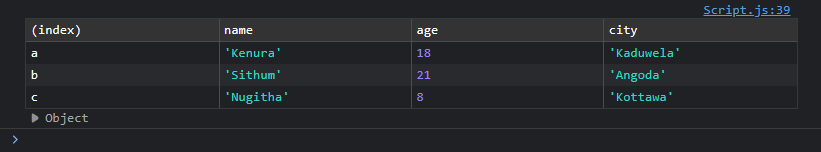
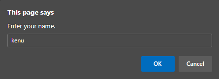
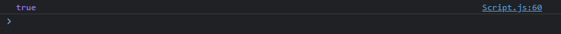

# JS Console Outputs #

## Log Message ##

```
console.log("You are currntly accessing the console.");
```
Output :


## Error Message ##

```
console.error("This is an error message!");
```
Output :


## Warn Message ##

```
console.warn("This is an warning message!");
```
Output :


## Table Output ##

```
    let a = {
        name: "Kenura",
        age: 18,
        city: "Kaduwela"
    };

    let b = {
        name: "Sithum",
        age: 21,
        city: "Angoda"
    };

    let c = {
        name: "Nugitha",
        age: 8,
        city: "Kottawa"
    };

    console.table({ a, b, c });
```
Output :



## Alert ##

```
alert("You opened the alert.");
```
Output :


## Prompt ##

```
let name = prompt("Enter your name.");

console.log("Hello " + name + "!");
```
Output :



## Confirm ##

```
let confirmation = confirm("Do you really want to \"confirm\".");

console.log("Confirm Value : " + confirmation);
```
Output :


## TypeOf ##

```
let a = "Kenura Ransana Gunarathna";

console.log(a.endsWith("thna"));
```
Output :


